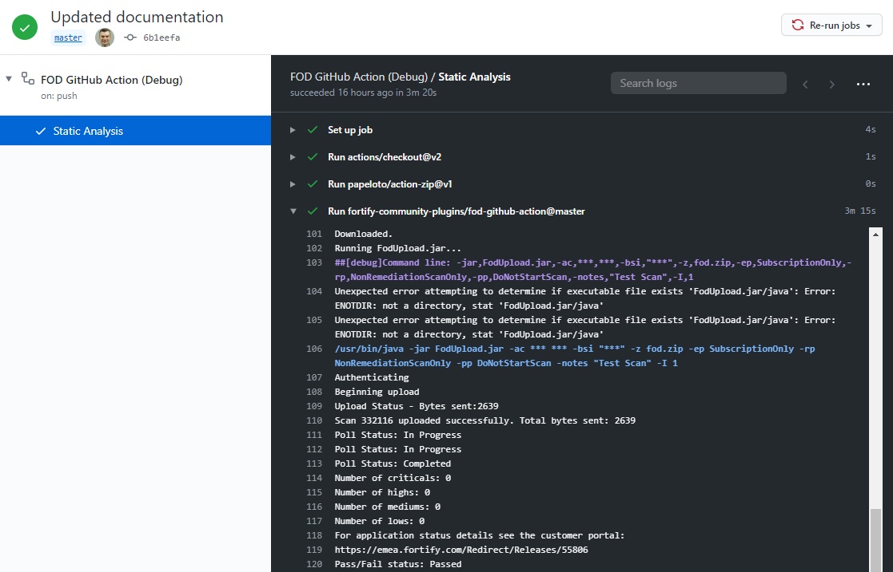

# Fortify on Demand (FOD) GitHub Action

#### Table of Contents

*   [Overview](#overview)
*   [Installation](#installation)
*   [Configuration](#configuration)
*   [Usage](#Usage)
*   [Logging and Troubleshooting](#logging-and-troubleshooting)
*   [Developing and Contributing](#developing-and-contributing)
*   [Licensing](#licensing)

## Overview

The Fortify on Demand GitHub Action allows you to upload your source code into [Fortify on Demand](https://www.microfocus.com/en-us/products/application-security-testing/overview)
and run a static analysis scan to discover any security vulnerabilities. The Action can also add a comment to the commit or pull request that includes details of the 
scan.  

The Action currently makes use of the [fod-uploader-java](https://github.com/fod-dev/fod-uploader-java) utility and downloads a
specific version as part of the process. The long term intention is to replace this utility with native Fortify on Demand REST API calls.

## Installation

There is no specific installation required - simply refer to a specific version of the Action in your workflow. 
For example to refer to `v1` of the Action:

```aidl
uses: fortify-community-plugins/fod-github-action@v1
```

A list of the versions and their history is available in the [CHANGELOG](CHANGELOG.md). 

For bleeding edge changes you can refer directly to the `master` branch:

```aidl
uses: fortify-community-plugins/fod-github-action@master
```

Please note that this is not recommended for day-to-day use as it could include un-tested development changes in progress.

## Configuration
  
### Step 1: Create your FOD API key

If you haven't already done so, sign up to [Fortify on Demand](https://www.microfocus.com/en-us/products/application-security-testing/free-trial).
Login in as a user with "Administrative" privileges and navigate to **Administration->Settings->API**.
Create a new **API Key** with (as a minimum) the "Start Scans" role.

 

Make a note of the **API Key** and **Secret Key** as these will be needed in the following steps.

Go to Fortify on Demand application release with which you want to integrate with and click on **Start Scan->Static**. Configure
the scan details as you require. Note: for automated scanning with no manual intervention you would normally select the
following:

  - **Assessment Type** = **Static Assessment**
  - **Audit Preference** = **Automated**
  
However, all of these settings can be overriden in the Action. Copy and save the contents of the `Build Server Integration Token`
field that is created for the next step. An example setup is shown below:  


### Step 2: Configure FOD API access in your GitHub repository

Now you need to add your Fortify on Demand API keys into GitHub. On GitHub, go to the repository in which you wish to use the Action.
Go to repository **Settings**  and click on the **Secrets**. Carry out the following:

 - Create a secret called `FOD_ACCESS_KEY` and set it to the value of the **API Key** generated in the previous step.

 - Create a secret called `FOD_SECRET_KEY` and set it to the value of the **Secret Key** generated in the previous step.
 
 - Create a secret called `BSI_TOKEN` and set it to the value of **Build Server Integration Token** generated in the previous step.

You should see a setup similar to the following:


### Step 3: Configure the GitHub Action

In your repository, create or update a GitHub Actions "workflow" file, e.g. `.github/workflows/main.yml` and insert the following content.

```yaml
on: [push]

jobs:
  check-quality:
    runs-on: ubuntu-latest
    name: Static Analysis
    steps:
      - uses: actions/checkout@v2
        with:
          fetch-depth: 1
      - uses: papeloto/action-zip@v1
        with:
          files: src/**
          dest: fod.zip
      - uses: fortify-community-plugins/fod-github-action@v1
        with:
          repo_token: ${{ secrets.GITHUB_TOKEN }}
          fod_credential_type: 'api'
          fod_access_key: ${{ secrets.FOD_ACCESS_KEY }}
          fod_secret_key: ${{ secrets.FOD_SECRET_KEY }}
          bsi_token: ${{ secrets.BSI_TOKEN }}
          entitlement_preference: 'SubscriptionOnly'
          remediation_scan_preference: 'NonRemediationScanOnly'
          in_progress_scan_action: 'DoNotStartScan'
          audit_preference_id: 'Automated'
          zip_location: 'fod.zip'
          polling_interval: '5'
          notes: 'FOD Github Action initiated Scan'
          update_commit: true
          update_pr: false
```

The following parameters should *NOT* be changed:

 * **repo_token**: this is created automatically and is how the Action can access your repository.
 * **fod_access_key**, **fod_access_key** and **bsi_token**: this is how the Action communicates with Fortify on Demand.

The following parameters should be changed:

 * **zip_location**: this is the location of a Zip file containing the source code you want to upload into FOD. 
    An example is shown above on how to create a Zip file from your source code using the *papeloto/action-zip* action.
 * **update_commit**: set to *true* if you want to add the output of the scan as a comment on the commit.
 * **update_pr**: set to *true* if you want to add the output of the scan as a comment on a pull request.
 
The remainder of the arguments are passed through to the [fod-uploader-java](https://github.com/fod-dev/fod-uploader-java) program.
If you are not sure what the arguments are, then please refer to its documentation.

### Step 4: Make a commit 

Once you have made the above changes, committing to your repository should automatically run the Action and you should 
see output similar to the following:

 

 

## Usage

### Username/Password authentication

As well as API access you can configure the Action to use Username/Password credentials as in the following:

```yaml
on: [push]

jobs:
  check-quality:
    runs-on: ubuntu-latest
    name: Static Analysis
...
      - uses: fortify-community-plugins/fod-github-action@v1
        with:
          repo_token: ${{ secrets.GITHUB_TOKEN }}
          fod_credential_type: 'user'
          fod_access_key: ${{ secrets.FOD_USERNAME }}
          fod_secret_key: ${{ secrets.FOD_PASSWORD }}
...
```

### Running on Push (Commits)

You can run the Action on every **push**, i.e. commit to the repository and add a comment to the commit with the details
of the scan executed using the following:

```aidl
on:
  push:
    branches:
    - master
    - feature/**

jobs:
  build:
    runs-on: ubuntu-latest
    name: Static Analysis
    steps:
...
      - uses: fortify-community-plugins/fod-github-action@master
        with:
          repo_token: ${{ secrets.GITHUB_TOKEN }}
...
          update_commit: true
...
```

This will example will run on commits to the `master` branch and any branches that are prefixed with `feature/`.

### Running on Pull Request

You can run the Action when a **pul request** is created and add a comment to the pull request with the details of the
scan executed using the following:

```aidl
on:
  pull_request:
    branches:
    - master

jobs:
  build:
    runs-on: ubuntu-latest
    name: Static Analysis
    steps:
...
      - uses: fortify-community-plugins/fod-github-action@master
        with:
          repo_token: ${{ secrets.GITHUB_TOKEN }}
...
          update_pr: true
``` 

If your process includes the creation on **pull requests** before merging feature changes onto the **master** branch
then the inclusion of FOD static analysis will form an important and useful review point.

## Logging and Troubleshooting

If the Action is not executing as you expect, then you can create a repository secret called `ACTIONS_STEP_DEBUG`.
Once created you should see debug message in the Action logs which will help you troubleshoot the problem.

 
## Developing and Contributing

If you wish to contribute to the development of this action, please contact me.

If you have any problems, please consult [GitHub Issues](https://github.com/fortify-community-plugins/fod-github-action/issues)
to see if has already been discussed.

## Licensing

**fod-github-action** is licensed under the [GNU General Public license](LICENSE).


---

*Please note: this is community content provided by and for the benefit of [Micro Focus](https://www.microfocus.com/) customers, 
it is not officially endorsed nor supported via [Micro Focus Software Support](https://www.microfocus.com/en-us/support).*


